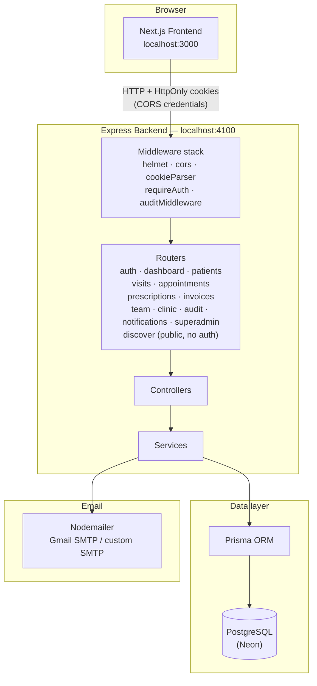
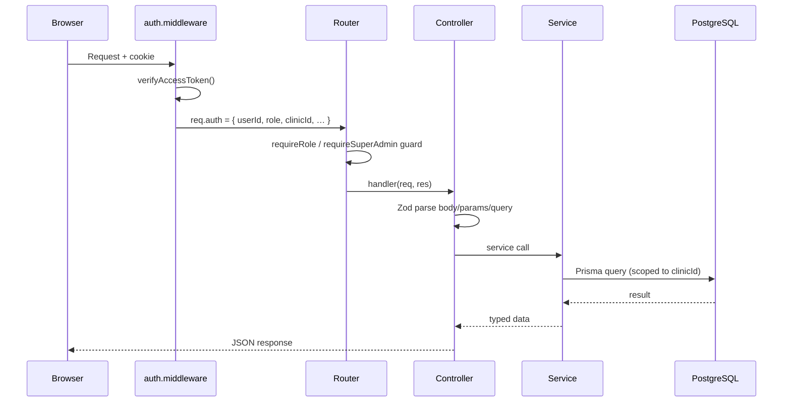
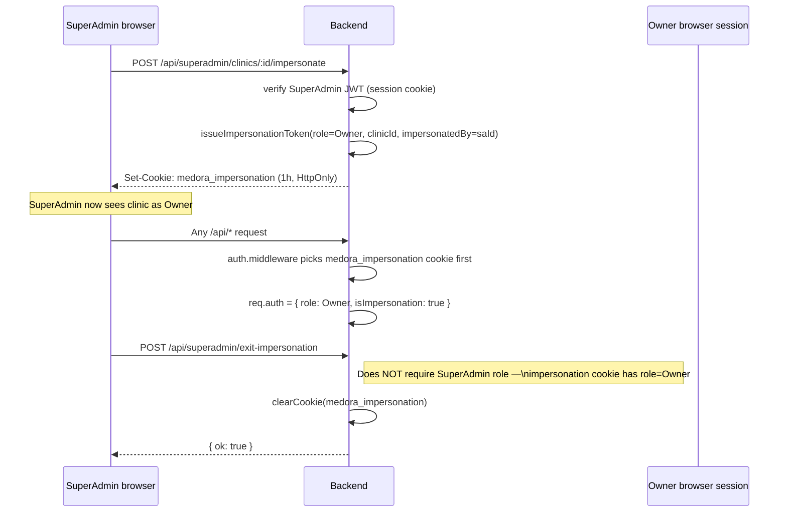

# Medora — Developer Reference

> Clinic management platform: patient records, appointments, prescriptions, billing, and a SuperAdmin layer for platform operations.

---

## Table of Contents

1. [Tech Stack](#tech-stack)
2. [System Architecture](#system-architecture)
3. [Database ERD](#database-erd)
4. [Project Structure](#project-structure)
5. [Getting Started](#getting-started)
6. [Environment Variables](#environment-variables)
7. [Authentication & Roles](#authentication--roles)
8. [Key Concepts](#key-concepts)
9. [API Overview](#api-overview)
10. [Frontend Routes](#frontend-routes)
11. [SuperAdmin Panel](#superadmin-panel)
12. [State Management](#state-management)
13. [Email](#email)
14. [Scripts & CLI Tools](#scripts--cli-tools)

---

## Tech Stack

| Layer | Technology |
|---|---|
| Frontend | Next.js 16 (App Router), React 19, TypeScript |
| Styling | Tailwind CSS v4, Shadcn/ui (Radix primitives) |
| State | Zustand (persisted to `localStorage`) |
| HTTP client | Axios (with auto-refresh interceptor) |
| Backend | Express 5, TypeScript, Node ≥ 20 |
| ORM | Prisma 6 |
| Database | PostgreSQL (Neon) |
| Auth | HS256 JWT in HttpOnly cookies, Argon2id password hashing |
| Email | Nodemailer (Gmail SMTP or custom SMTP) |
| Validation | Zod (backend schemas + env) |
| API Docs | Scalar (`/api/docs`) |
| Charts | Recharts |

---

## System Architecture



### Request lifecycle



### Impersonation flow



---

## Database ERD

```mermaid
erDiagram
    Clinic {
        string id PK
        string name
        string slug UK
        string phone
        ClinicStatus status
        string address
        string city
        string state
        string pincode
        string[] specialties
        string description
        datetime createdAt
        datetime updatedAt
    }

    User {
        string id PK
        string email UK
        string passwordHash
        string name
        UserRole role
        UserStatus status
        string clinicId FK
        boolean emailVerified
        datetime createdAt
        datetime updatedAt
    }

    Patient {
        string id PK
        string clinicId FK
        string name
        string phone
        string email
        string address
        int age
        string gender
        datetime nextVisitDate
        datetime createdAt
        datetime updatedAt
    }

    Visit {
        string id PK
        string clinicId FK
        string patientId FK
        string doctorId FK
        string title
        string reason
        VisitStatus status
        datetime startedAt
        datetime createdAt
        datetime updatedAt
    }

    Appointment {
        string id PK
        string clinicId FK
        string patientId FK
        string doctorId FK
        datetime date
        string startTime
        string endTime
        string reason
        AppointmentStatus status
        datetime createdAt
        datetime updatedAt
    }

    Prescription {
        string id PK
        string clinicId FK
        string patientId FK
        string doctorId FK
        string number
        datetime date
        string diagnosis
        string notes
        datetime createdAt
        datetime updatedAt
    }

    PrescriptionItem {
        string id PK
        string prescriptionId FK
        string name
        string dosage
        string frequency
        string duration
        string notes
    }

    Invoice {
        string id PK
        string clinicId FK
        string patientId FK
        string doctorId FK
        string number
        int total
        InvoiceStatus status
        int discount
        int gst
        datetime issuedAt
        datetime createdAt
        datetime updatedAt
    }

    InvoiceItem {
        string id PK
        string invoiceId FK
        string label
        int amount
    }

    PasswordResetToken {
        string id PK
        string tokenHash UK
        string userId FK
        datetime expiresAt
        datetime createdAt
    }

    RefreshToken {
        string id PK
        string tokenHash UK
        string userId FK
        boolean rememberMe
        datetime expiresAt
        datetime createdAt
    }

    EmailVerificationToken {
        string id PK
        string tokenHash UK
        string userId FK
        datetime expiresAt
        datetime createdAt
    }

    AuditLog {
        string id PK
        string userId FK
        string clinicId
        string action
        string resource
        json metadata
        string ip
        string userAgent
        datetime createdAt
    }

    ClinicFeatureFlags {
        string id PK
        string clinicId UK FK
        boolean publicBooking
        boolean whatsappNotifications
        datetime createdAt
        datetime updatedAt
    }

    Broadcast {
        string id PK
        string clinicId FK
        string userId
        string audience
        string kind
        string title
        string body
        int recipientCount
        datetime sentAt
    }

    ClinicSubscription {
        string id PK
        string clinicId UK FK
        string plan
        string billingStatus
        datetime trialEndsAt
        datetime currentPeriodStart
        datetime currentPeriodEnd
        datetime createdAt
        datetime updatedAt
    }

    PlatformConfig {
        string id PK
        boolean maintenanceMode
        string bannerMessage
        datetime updatedAt
    }

    Clinic ||--o{ User : "has members"
    Clinic ||--o{ Patient : "has patients"
    Clinic ||--o{ Visit : "has visits"
    Clinic ||--o{ Appointment : "has appointments"
    Clinic ||--o{ Prescription : "has prescriptions"
    Clinic ||--o{ Invoice : "has invoices"
    Clinic ||--|| ClinicFeatureFlags : "has flags"
    Clinic ||--|| ClinicSubscription : "has subscription"
    Clinic ||--o{ Broadcast : "has broadcasts"
    Clinic ||--o{ SupportTicket : "has tickets"
    Clinic ||--o{ PaymentRecord : "has payments"
    Clinic ||--o{ DataDeletionRequest : "has deletion requests"

    SupportTicket {
        string id PK
        string clinicId FK
        string subject
        string status
        string priority
        datetime createdAt
        datetime updatedAt
    }

    TicketMessage {
        string id PK
        string ticketId FK
        string body
        boolean isStaff
        string authorId
        datetime createdAt
    }

    PaymentRecord {
        string id PK
        string clinicId FK
        int amount
        string plan
        string status
        string description
        datetime periodStart
        datetime periodEnd
        datetime createdAt
    }

    DataDeletionRequest {
        string id PK
        string clinicId FK
        string reason
        string status
        string requestedBy
        datetime scheduledAt
        datetime completedAt
        datetime createdAt
        datetime updatedAt
    }

    SuperAdminBroadcast {
        string id PK
        string subject
        string body
        string segment
        int recipientCount
        string sentBy
        datetime sentAt
        datetime createdAt
    }

    CustomPlan {
        string id PK
        string name
        string description
        int price
        int maxPatients
        int maxUsers
        json features
        boolean isActive
        datetime createdAt
        datetime updatedAt
    }

    SupportTicket ||--o{ TicketMessage : "has messages"

    Patient ||--o{ Visit : "has visits"
    Patient ||--o{ Appointment : "has appointments"
    Patient ||--o{ Prescription : "has prescriptions"
    Patient ||--o{ Invoice : "has invoices"

    User ||--o{ Visit : "attends as doctor"
    User ||--o{ Appointment : "attends as doctor"
    User ||--o{ Prescription : "issues as doctor"
    User ||--o{ Invoice : "issues as doctor"
    User ||--o{ PasswordResetToken : "has tokens"
    User ||--o{ RefreshToken : "has sessions"
    User ||--o{ EmailVerificationToken : "has tokens"
    User ||--o{ AuditLog : "has logs"

    Prescription ||--o{ PrescriptionItem : "has items"
    Invoice ||--o{ InvoiceItem : "has items"
```

---

## Project Structure

```
medora/
├── backend/
│   ├── prisma/
│   │   ├── schema.prisma          # Database schema (source of truth)
│   │   ├── migrations/            # Migration history
│   │   └── seed.ts                # Demo/dev seed data
│   └── src/
│       ├── index.ts               # Server entry point
│       ├── app.ts                 # Express app factory
│       ├── config/
│       │   └── env.ts             # Zod-validated env vars
│       ├── middleware/
│       │   ├── auth.middleware.ts             # JWT → req.auth
│       │   ├── audit.middleware.ts            # Auto-log requests
│       │   ├── rate-limit.middleware.ts       # Per-route rate limits
│       │   ├── roles.middleware.ts            # requireRole()
│       │   ├── require-superadmin.middleware.ts
│       │   ├── error.middleware.ts
│       │   └── not-found.middleware.ts
│       ├── routes/
│       │   ├── index.ts           # Aggregates all routers + requireAuth
│       │   ├── auth.routes.ts
│       │   ├── discover.routes.ts # Public: search, get-by-slug, public booking (no auth)
│       │   ├── dashboard.routes.ts
│       │   ├── patients.routes.ts
│       │   ├── visits.routes.ts
│       │   ├── appointments.routes.ts
│       │   ├── prescriptions.routes.ts
│       │   ├── invoices.routes.ts
│       │   ├── team.routes.ts
│       │   ├── clinic.routes.ts
│       │   ├── audit.routes.ts
│       │   ├── notifications.routes.ts  # Broadcast send + history (auth required)
│       │   ├── superadmin.routes.ts
│       │   └── health.routes.ts
│       ├── controllers/           # Parse request, call service, send response
│       │   └── notifications.controller.ts
│       ├── services/              # Business logic + Prisma queries
│       │   ├── discover.service.ts     # Clinic search, get-by-slug, public appointment creation
│       │   ├── notifications.service.ts # saveBroadcast, getBroadcasts
│       ├── schemas/               # Zod schemas for request validation
│       ├── lib/
│       │   ├── prisma.ts          # Prisma client singleton
│       │   ├── auth-cookie.ts     # Cookie helpers
│       │   ├── password-reset-email.ts
│       │   ├── verify-email.ts
│       │   └── email-templates/   # HTML email templates
│       ├── openapi/
│       │   └── spec.ts            # OpenAPI 3.0 spec (→ Scalar docs)
│       ├── types/
│       │   └── express.d.ts       # req.auth type augmentation
│       ├── utils/
│       │   ├── http-error.ts      # Custom error class
│       │   ├── async-handler.ts   # Wraps async controllers
│       │   └── phone.ts           # Phone normalisation
│       └── scripts/
│           └── create-superadmin.ts
│
└── frontend/
    └── src/
        ├── app/                   # Next.js App Router pages
        │   ├── (auth)/            # Login, signup, forgot/reset password
        │   ├── onboarding/        # 6-step clinic setup wizard
        │   ├── dashboard/         # Main authenticated app
        │   │   ├── _components/   # Shared dashboard layout components
        │   │   ├── _hooks/        # Dashboard-scoped hooks
        │   │   ├── queue/
        │   │   ├── calendar/
        │   │   ├── patients/
        │   │   ├── prescriptions/
        │   │   ├── billing/
        │   │   ├── reports/
        │   │   ├── revenue/
        │   │   ├── settings/
        │   │   └── notifications/
        │   ├── superadmin/        # Platform admin panel
        │   ├── print/             # Printable invoice & prescription views
        │   ├── find-clinics/      # Public patient-facing clinic search
        │   └── book/[clinicSlug]/ # Public patient booking
        ├── components/
        │   ├── ui/                # Shadcn/ui primitives
        │   ├── landing/           # Marketing page sections
        │   ├── onboarding/        # Wizard step components
        │   └── dashboard/         # Shared dashboard components
        ├── services/              # Axios API calls (one file per domain)
        │   ├── discover.service.ts      # searchClinics, getClinicBySlug, createPublicBookingAppointment
        │   ├── notifications.service.ts # postBroadcast, getBroadcasts
        ├── stores/
        │   ├── clinic-store.ts    # Main app state (Zustand + persist)
        │   └── onboarding-store.ts
        ├── hooks/
        │   └── use-audit-logger.ts
        └── lib/
            ├── utils.ts
            ├── i18n/
            └── …
```

---

## Getting Started

### Prerequisites

- Node.js ≥ 20
- pnpm (or npm/yarn)
- A PostgreSQL database (Neon free tier works)
- Optional: Gmail account with an App Password for email

### 1. Clone and install

```bash
git clone <repo>
cd medora

# Backend
cd backend && npm install

# Frontend (separate terminal)
cd ../frontend && npm install
```

### 2. Configure environment

```bash
# Backend
cp backend/.env.example backend/.env
# Fill in DATABASE_URL, JWT_SECRET, and optionally SMTP vars (see below)

# Frontend
echo "NEXT_PUBLIC_API_URL=http://localhost:4100" > frontend/.env.local
```

### 3. Set up the database

```bash
cd backend
npm run db:migrate   # Apply migrations
npm run db:seed      # Optional: seed demo data
```

### 4. Create a SuperAdmin

```bash
cd backend
npm run superadmin:create
# Prompts for name, email, and password
```

### 5. Run both services

```bash
# Terminal 1 — Backend (http://localhost:4100)
cd backend && npm run dev

# Terminal 2 — Frontend (http://localhost:3000)
cd frontend && npm run dev
```

**API docs:** `http://localhost:4100/api/docs`

---

## Environment Variables

### Backend (`backend/.env`)

| Variable | Required | Default | Description |
|---|---|---|---|
| `PORT` | No | `4100` | Express server port |
| `NODE_ENV` | No | `development` | `development` / `production` |
| `DATABASE_URL` | **Yes** | — | Neon pooled connection string |
| `DIRECT_URL` | No | — | Neon direct URL (needed for migrations) |
| `JWT_SECRET` | **Yes** | — | HS256 signing secret (≥ 16 chars) |
| `JWT_EXPIRES_IN` | No | `7d` | Default session lifetime |
| `JWT_SESSION_EXPIRES_IN` | No | `1d` | Short session TTL |
| `JWT_REMEMBER_ME_EXPIRES_IN` | No | `30d` | "Remember me" TTL |
| `AUTH_COOKIE_NAME` | No | `medora_session` | HttpOnly cookie name |
| `REFRESH_COOKIE_NAME` | No | `medora_refresh` | Refresh token cookie name |
| `CORS_ORIGINS` | No | (allow all in dev) | Comma-separated allowed origins |
| `APP_ORIGIN` | No | `http://localhost:3000` | Frontend URL (used in emails) |
| `PASSWORD_RESET_TTL_MINUTES` | No | `60` | Reset link expiry (max 1440) |
| `EMAIL_VERIFICATION_TTL_MINUTES` | No | `60` | Verification link expiry (max 1440) |
| `USE_GMAIL_SMTP` | No | `false` | Set `true` to use Gmail |
| `SMTP_HOST` | No | — | Custom SMTP hostname |
| `SMTP_PORT` | No | `587` | Custom SMTP port |
| `SMTP_USER` | No | — | SMTP username / Gmail address |
| `SMTP_PASSWORD` | No | — | SMTP password / Gmail App Password |
| `MAIL_FROM` | No | — | Sender e.g. `"Medora <no-reply@example.com>"` |

> Without SMTP configured, password reset and verification links only appear in the Scalar API console response — fine for local development.

### Frontend (`frontend/.env.local`)

| Variable | Required | Default | Description |
|---|---|---|---|
| `NEXT_PUBLIC_API_URL` | No | `http://localhost:4100` | Backend base URL |

---

## Authentication & Roles

### Cookie-based sessions

After login or register, the backend sets an HttpOnly cookie (`medora_session`) containing a signed HS256 JWT. The frontend never reads the cookie directly — it sends it automatically with every request (`withCredentials: true`).

A **refresh token** is stored in a second HttpOnly cookie (`medora_refresh`). The Axios interceptor in `frontend/src/services/api.ts` automatically calls `POST /api/auth/refresh` on 401 responses before retrying the original request.

### User roles

| Role | Access |
|---|---|
| `Owner` | Full access to their clinic. Can manage team, billing, settings. |
| `Doctor` | Can create/view patients, visits, prescriptions, invoices. No settings access. |
| `Receptionist` | Can create/view patients, visits, appointments, invoices. No prescriptions. |
| `SuperAdmin` | Platform-wide access. Cannot access clinic data directly — must **impersonate** a clinic first. |

Role checks are enforced server-side:
- `requireAuth` — any logged-in user
- `requireRole("Owner")` — Owner only (in team and clinic routes)
- `requireSuperAdmin` — SuperAdmin role only

### JWT payload shape

```ts
{
  sub: string;           // user ID
  email: string;
  role: UserRole;
  clinicId?: string;     // absent for SuperAdmin
  isImpersonation?: boolean;
  impersonatedBy?: string;  // SuperAdmin user ID
  iat: number;
  exp: number;
  iss: "medora-api";
}
```

---

## Key Concepts

### Multi-tenancy

Every piece of clinic data (patients, visits, etc.) has a `clinicId` column. All service functions receive the `clinicId` from `req.auth` and scope every Prisma query to it — there is no shared data between clinics.

### Audit logging

`auditMiddleware` automatically writes an `AuditLog` row for every mutating request (`POST`, `PATCH`, `PUT`, `DELETE`) on authenticated routes. The log captures `userId`, `clinicId`, `action` (HTTP method + path), `resource` (body summary), `ip`, and `userAgent`.

Client-side events (page views, button clicks) can also be sent via `POST /api/audit/event` from the frontend's `useAuditLogger` hook.

### SuperAdmin impersonation

A SuperAdmin can view any clinic as an Owner without knowing the clinic's password:

1. `POST /api/superadmin/clinics/:id/impersonate` — issues a short-lived (1h) impersonation JWT in a second cookie (`medora_impersonation`).
2. `auth.middleware` picks the impersonation cookie over the session cookie when both are present.
3. The impersonation banner in the dashboard detects `isImpersonation: true` and shows an **Exit** button.
4. `POST /api/superadmin/exit-impersonation` clears the cookie. **This route is intentionally placed before `requireSuperAdmin`** because the active JWT role is `Owner` during impersonation.

### Clinic discovery

Patients find clinics via `GET /api/discover/clinics` — a public, unauthenticated endpoint. It returns only clinics whose status is `active` and whose `publicBooking` feature flag is enabled.

Query parameters: `city` (case-insensitive partial match), `pincode` (partial match), `specialty` (exact array match against `specialties`). Results include doctor count and link to the clinic's `/book/[slug]` page.

Clinics populate their discovery profile during onboarding (profile step) and can update it anytime in **Settings → Profile** (city, state, pincode, specialties, description are all API-backed and stored in the `clinics` table).

### Public booking

The `/book/[clinicSlug]` page is a public 4-step flow (doctor → date → time → details) that requires no authentication. On load, the Next.js server component calls `GET /api/discover/clinics/:slug` to validate the clinic exists and fetch its active doctors. The data is passed as props to the client component — no Zustand store is used.

On submit, the client POSTs to `POST /api/discover/clinics/:slug/appointments`. The backend will:
1. Reject if the clinic is not active or `publicBooking` is disabled.
2. Look up the patient by `(clinicId, phone)`; create a new `Patient` row if not found.
3. Create the `Appointment` with status `scheduled`.

Slots are 30-minute fixed intervals (00:00–23:30). No real-time conflict detection on the public page — the clinic manages overlapping bookings from the dashboard calendar.

### Broadcast notifications

The **Notifications** page (`/dashboard/notifications`) lets clinic staff send WhatsApp-style bulk messages to patient segments (this week's patients, closest upcoming visit, all patients).

Broadcasts are persisted to the `broadcasts` table via `POST /api/notifications/broadcast` and loaded on page mount via `GET /api/notifications/broadcasts`. The page keeps a local React state for the history list and updates it optimistically on send. The audience and kind values are stored as free-form strings so new segments can be added without schema changes.

### Feature flags

`ClinicFeatureFlags` is a one-to-one extension of `Clinic` holding per-clinic toggles:
- `publicBooking` — enables the `/book/:slug` public booking page
- `whatsappNotifications` — enables the WhatsApp reminder button

SuperAdmins manage these via `PATCH /api/superadmin/config/flags/:id`.

### Prescriptions & Invoices

Both follow the same **header + line-items** pattern:
- `Prescription` → `PrescriptionItem[]` (medicine name, dosage, frequency, duration)
- `Invoice` → `InvoiceItem[]` (label, amount in paise/smallest unit)

Each gets an auto-generated sequential `number` scoped per clinic (unique on `(clinicId, number)`).

### Phone normalisation

Indian mobile numbers are normalised server-side to `91XXXXXXXXXX` format via `src/utils/phone.ts`. The frontend shows them with a `+91` prefix.

---

## API Overview

Full interactive docs at `/api/docs` (Scalar).

| Prefix | Auth required | Description |
|---|---|---|
| `GET /health` | No | Liveness probe (no DB) |
| `GET /api/health` | No | DB connectivity check |
| `POST /api/auth/*` | Mostly no | Register, login, logout, password reset, email verification |
| `GET /api/auth/me` | Yes | Current user |
| `GET /api/discover/clinics` | No | Public clinic search — filter by `city`, `pincode`, `specialty` |
| `GET /api/discover/clinics/:slug` | No | Fetch a single active clinic by slug (includes doctor list) |
| `POST /api/discover/clinics/:slug/appointments` | No | Submit a public booking (creates patient if new, then appointment) |
| `GET/PATCH /api/dashboard/*` | Yes | Overview, queue, revenue |
| `POST/GET/PATCH /api/patients/*` | Yes | Patient CRUD |
| `POST /api/visits` | Yes | Create visit |
| `GET/POST/PATCH /api/appointments/*` | Yes | Appointment CRUD |
| `GET/POST /api/prescriptions/*` | Yes | Prescription CRUD |
| `POST/PATCH /api/invoices/*` | Yes | Invoice CRUD |
| `GET/POST/DELETE /api/team/*` | Yes (Owner for write) | Team members |
| `GET/PATCH /api/clinic` | Yes (Owner for write) | Clinic profile (includes location + specialties) |
| `POST /api/audit/event` | Yes | Client-side event log |
| `GET /api/audit/logs` | Yes (SuperAdmin) | Query audit logs |
| `GET /api/audit/stats` | Yes (SuperAdmin) | Audit stats |
| `POST /api/notifications/broadcast` | Yes | Save a sent broadcast (audience, kind, title, body, recipientCount) |
| `GET /api/notifications/broadcasts` | Yes | List broadcast history for the current clinic |
| `POST /api/superadmin/exit-impersonation` | Yes (any auth) | Exit impersonation session |
| `GET/POST/PATCH/DELETE /api/superadmin/clinics` | Yes (SuperAdmin) | Clinic CRUD, status, impersonate |
| `POST /api/superadmin/clinics/bulk` | Yes (SuperAdmin) | Bulk activate / suspend / delete clinics |
| `GET/POST/PATCH/DELETE /api/superadmin/users` | Yes (SuperAdmin) | User management, force reset, verify email |
| `GET /api/superadmin/analytics` | Yes (SuperAdmin) | Platform analytics overview |
| `GET /api/superadmin/financial` | Yes (SuperAdmin) | MRR, ARR, churn rate, revenue by plan, MRR trend |
| `GET /api/superadmin/health-scores` | Yes (SuperAdmin) | Clinic activity health scores (at-risk view) |
| `GET /api/superadmin/onboarding` | Yes (SuperAdmin) | Onboarding completion per clinic |
| `GET/POST /api/superadmin/broadcasts` | Yes (SuperAdmin) | SuperAdmin broadcast emails by segment |
| `GET/POST /api/superadmin/tickets` | Yes (SuperAdmin) | Support ticket list and create |
| `GET /api/superadmin/tickets/:id` | Yes (SuperAdmin) | Ticket detail with message thread |
| `POST /api/superadmin/tickets/:id/reply` | Yes (SuperAdmin) | Add reply to a ticket |
| `PATCH /api/superadmin/tickets/:id/status` | Yes (SuperAdmin) | Update ticket status |
| `GET/POST /api/superadmin/admins` | Yes (SuperAdmin) | List and create SuperAdmin accounts |
| `DELETE /api/superadmin/admins/:id` | Yes (SuperAdmin) | Delete a SuperAdmin account |
| `GET/POST /api/superadmin/payments` | Yes (SuperAdmin) | Payment record list and create |
| `GET/POST /api/superadmin/gdpr/requests` | Yes (SuperAdmin) | GDPR deletion request list and create |
| `PATCH /api/superadmin/gdpr/requests/:id/status` | Yes (SuperAdmin) | Approve / reject / complete deletion request |
| `GET /api/superadmin/system-health` | Yes (SuperAdmin) | DB stats, activity trend, uptime |
| `GET /api/superadmin/api-usage` | Yes (SuperAdmin) | Per-clinic request volume from audit logs |
| `GET/POST /api/superadmin/custom-plans` | Yes (SuperAdmin) | Custom billing plans |
| `PATCH/DELETE /api/superadmin/custom-plans/:id` | Yes (SuperAdmin) | Update or delete a custom plan |
| `GET /api/superadmin/export/clinics` | Yes (SuperAdmin) | Download clinics CSV |
| `GET /api/superadmin/export/users` | Yes (SuperAdmin) | Download users CSV |
| `GET /api/superadmin/export/audit-logs` | Yes (SuperAdmin) | Download audit log CSV |
| `GET /api/superadmin/export/clinic/:id` | Yes (SuperAdmin) | Download all data for one clinic (JSON) |
| `GET/PATCH /api/superadmin/config/flags` | Yes (SuperAdmin) | Per-clinic feature flags |
| `GET/PATCH /api/superadmin/config/platform` | Yes (SuperAdmin) | Platform-wide config (maintenance mode, banner) |
| `GET/PATCH /api/superadmin/billing` | Yes (SuperAdmin) | Billing subscription list, extend trial, set plan |

---

## Frontend Routes

| Path | Authenticated | Description |
|---|---|---|
| `/` | No | Landing / marketing page |
| `/login` | No | Login form |
| `/signup` | No | Signup form |
| `/forgot-password` | No | Request reset email |
| `/reset-password` | No | Set new password via token |
| `/onboarding/*` | Yes | 6-step clinic setup wizard |
| `/dashboard` | Yes | Overview with stats and charts |
| `/dashboard/queue` | Yes | Live patient queue |
| `/dashboard/calendar` | Yes | Appointment calendar |
| `/dashboard/patients` | Yes | Patient list |
| `/dashboard/patients/[id]` | Yes | Patient detail + history |
| `/dashboard/prescriptions` | Yes | Prescriptions list |
| `/dashboard/billing` | Yes | Invoices list |
| `/dashboard/reports` | Yes | Demographics & visit analytics |
| `/dashboard/revenue` | Yes | Revenue analytics |
| `/dashboard/settings` | Yes | Clinic profile, team, appearance |
| `/dashboard/notifications` | Yes | Notification centre |
| `/print/invoice/[id]` | Yes | Printable invoice |
| `/print/rx/[id]` | Yes | Printable prescription |
| `/find-clinics` | No | Patient-facing clinic discovery — search by city, pincode, specialty |
| `/book/[clinicSlug]` | No | Public patient booking page |
| `/superadmin` | Yes (SuperAdmin) | Platform overview |
| `/superadmin/clinics` | Yes (SuperAdmin) | All clinics — search, filter, bulk actions, impersonate |
| `/superadmin/users` | Yes (SuperAdmin) | All users — status, force reset, verify email |
| `/superadmin/analytics` | Yes (SuperAdmin) | Platform analytics |
| `/superadmin/financial` | Yes (SuperAdmin) | Financial dashboard — MRR/ARR, churn, revenue by plan |
| `/superadmin/health` | Yes (SuperAdmin) | Clinic health scores — at-risk clinics |
| `/superadmin/billing` | Yes (SuperAdmin) | Subscription management, extend trial |
| `/superadmin/payments` | Yes (SuperAdmin) | Invoice & payment history |
| `/superadmin/onboarding` | Yes (SuperAdmin) | Onboarding completion tracker per clinic |
| `/superadmin/tickets` | Yes (SuperAdmin) | Support ticket system with threaded replies |
| `/superadmin/broadcasts` | Yes (SuperAdmin) | Broadcast emails to clinic owners by segment |
| `/superadmin/admins` | Yes (SuperAdmin) | SuperAdmin account management |
| `/superadmin/gdpr` | Yes (SuperAdmin) | GDPR deletion requests — approve/reject/complete |
| `/superadmin/system-health` | Yes (SuperAdmin) | DB snapshot, activity trend, uptime |
| `/superadmin/api-usage` | Yes (SuperAdmin) | Per-clinic API request volume |
| `/superadmin/custom-plans` | Yes (SuperAdmin) | Custom plan builder |
| `/superadmin/config` | Yes (SuperAdmin) | Feature flags and platform config |
| `/superadmin/logs` | Yes (SuperAdmin) | Audit log viewer with export |

---

## SuperAdmin Panel

The SuperAdmin panel (`/superadmin/*`) is a separate section of the app protected by `requireSuperAdmin` middleware. SuperAdmins cannot access clinic data directly — they must impersonate a clinic first.

### Features

| Feature | Page | Description |
|---|---|---|
| Clinic Management | `/superadmin/clinics` | List, search, filter, activate/suspend, delete, impersonate. Bulk actions (activate all, suspend all, delete all selected). |
| User Management | `/superadmin/users` | List all users across all clinics. Activate/suspend, force password reset, manually verify email. |
| Financial Dashboard | `/superadmin/financial` | MRR, ARR, churn rate, trials expiring. MRR trend (12 months), revenue by plan breakdown, top clinic by MRR. |
| Clinic Health Scores | `/superadmin/health` | Per-clinic activity score (0–100) calculated from appointments, patients, and invoices in the last 30 days. Risk-level filter (high/medium/low). |
| Billing Management | `/superadmin/billing` | View subscription status per clinic, extend trial by N days, change plan. |
| Payment History | `/superadmin/payments` | Manual payment records per clinic. Create paid/pending/failed/refunded records for accounting. |
| Onboarding Tracker | `/superadmin/onboarding` | Per-clinic step completion (profile, hours, team, services, first patient, first appointment). Highlights clinics below 60%. |
| Support Tickets | `/superadmin/tickets` | Split-view ticket list + threaded message detail. Create tickets on behalf of a clinic, reply as staff, change status (open/in_progress/resolved/closed). |
| Broadcast Messaging | `/superadmin/broadcasts` | Send emails to clinic owners filtered by segment (all, trial, active, cancelled, starter, pro). Sent history with recipient count. |
| SuperAdmin Accounts | `/superadmin/admins` | List, create, and delete SuperAdmin accounts. Two-click confirmation on delete. |
| GDPR / Data Tools | `/superadmin/gdpr` | Deletion requests — submit, approve, reject, or mark complete. Export full clinic data as JSON. |
| System Health | `/superadmin/system-health` | DB row counts (clinics, users, patients, appointments, invoices), activity stats (last 24h / 7d / errors), active users count, 7-day bar chart, server uptime. |
| API Usage | `/superadmin/api-usage` | Per-clinic audit-log request count for the past 30 days. Relative bar visualization, ranked by volume. |
| Custom Plans | `/superadmin/custom-plans` | Create bespoke plans with name, price, patient/user limits, and feature toggles. Used when standard Starter/Pro doesn't fit. |
| Feature Flags | `/superadmin/config` | Toggle `publicBooking` and `whatsappNotifications` per clinic. Platform-wide maintenance mode and banner message. |
| Data Export | Clinics, Users, Audit Logs pages | Export current filtered view as CSV via `GET /api/superadmin/export/{type}`. Per-clinic JSON export from GDPR page. |
| Bulk Operations | `/superadmin/clinics` | Select multiple clinics via checkboxes and bulk-activate, bulk-suspend, or bulk-delete in one action. |

### Plan pricing (hardcoded constants)

The financial dashboard calculates MRR/ARR from `ClinicSubscription.plan` using these constants:

| Plan | Monthly price (paise) | INR |
|---|---|---|
| `trial` | 0 | ₹0 |
| `starter` | 299900 | ₹2,999 |
| `pro` | 799900 | ₹7,999 |
| `custom` | varies (from `CustomPlan.price`) | — |

### Broadcast segments

| Segment value | Audience |
|---|---|
| `all` | All clinic owners |
| `trial` | Clinics on trial billing status |
| `active` | Clinics with active (paid) status |
| `cancelled` | Clinics with cancelled status |
| `starter` | Clinics on the Starter plan |
| `pro` | Clinics on the Pro plan |

---

## State Management

The frontend uses **Zustand** with `localStorage` persistence.

### `clinic-store`

The main app store. Holds everything needed for the dashboard:

```
session: { user, clinic, isImpersonating }
patients[]
visits[]
appointments[]
prescriptions[]
invoices[]
teamMembers[]
overviewStats: { appointmentsToday, waitingCount, patientsTotal, unpaidCount }
clinicProfile        ← full clinic from GET /api/clinic
```

Key actions:
- `signIn(session)` — called after login or token refresh; stores user + clinic stub
- `signOut()` — clears store and redirects to `/login`
- `hydrateDashboardData(payload)` — bulk-updates patients, visits, appointments, invoices, prescriptions, team on dashboard mount
- `addPatient / updatePatient`, `addVisit / setVisitStatus`, `addAppointment / setAppointmentStatus`, etc. — optimistic updates after write API calls

> **Broadcast history** is no longer held in the store. The Notifications page manages its own local state, fetched from `GET /api/notifications/broadcasts` on mount and updated optimistically after `POST /api/notifications/broadcast`.

### `onboarding-store`

Wizard state persisted across the 6 onboarding steps (clinic name, working hours, team invites, services). Cleared on completion.

---

## Email

Emails are sent via Nodemailer. Two transports are supported:

**Gmail SMTP** — set `USE_GMAIL_SMTP=true`, provide your Gmail address as `SMTP_USER`, and a [Gmail App Password](https://support.google.com/accounts/answer/185833) as `SMTP_PASSWORD`.

**Custom SMTP** — set `SMTP_HOST`, `SMTP_PORT`, `SMTP_USER`, `SMTP_PASSWORD`, and `MAIL_FROM`.

**No SMTP configured** — The app still works; reset links and verification tokens are returned in the API response (visible in Scalar docs). Suitable for local development.

Two email types are sent:
- **Password reset** — token valid for `PASSWORD_RESET_TTL_MINUTES` (default 60 min)
- **Email verification** — token valid for `EMAIL_VERIFICATION_TTL_MINUTES` (default 60 min)

HTML templates live in `backend/src/lib/email-templates/`.

---

## Scripts & CLI Tools

Run from the `backend/` directory.

| Command | Description |
|---|---|
| `npm run dev` | Start backend with hot reload (tsx watch) |
| `npm run build` | Compile TypeScript to `dist/` |
| `npm run start` | Run compiled backend |
| `npm run typecheck` | TypeScript type-check without emitting |
| `npm run db:migrate` | Apply pending Prisma migrations |
| `npm run db:push` | Push schema changes without migration file (dev only) |
| `npm run db:generate` | Regenerate Prisma client after schema changes |
| `npm run db:studio` | Open Prisma Studio GUI |
| `npm run db:seed` | Seed demo data |
| `npm run superadmin:create` | Interactive CLI to create a SuperAdmin user |

Run from `frontend/`:

| Command | Description |
|---|---|
| `npm run dev` | Start Next.js dev server |
| `npm run build` | Production build |
| `npm run start` | Serve production build |
| `npm run lint` | ESLint check |
